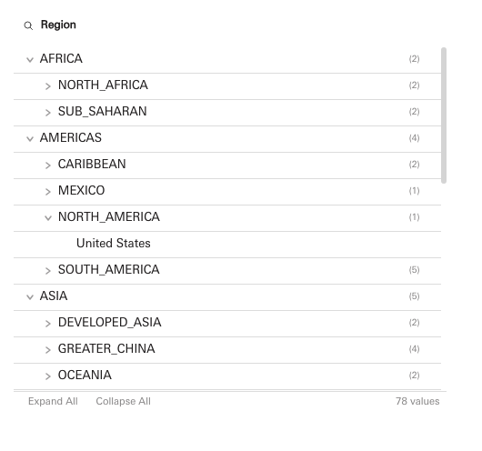
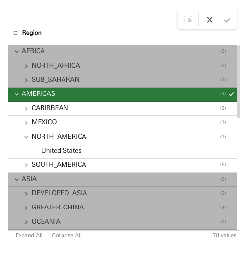
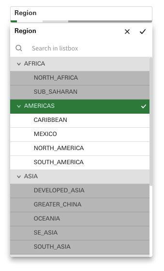

# Hierarchical Tree Filter

A tree-structured filter extension for Qlik Sense with expand/collapse capabilities, supporting both **parent-child** and **multi-dimension** hierarchies. Designed to function as a native-like filter pane with full selection state management.

**Version:** 99.11.0

<table><tr>
  <td valign="top"></td>
  <td valign="top"></td>
  <td valign="top"></td>
</tr></table>


---

## Table of Contents

- [Features](#features)
- [Installation](#installation)
- [Getting Started](#getting-started)
- [Hierarchy Modes](#hierarchy-modes)
  - [Multi-Dimension Mode](#multi-dimension-mode)
  - [Parent-Child Mode](#parent-child-mode)
- [Configuration](#configuration)
  - [General Settings](#general-settings)
  - [Tree Display](#tree-display)
  - [Header Styling](#header-styling)
  - [Content Styling](#content-styling)
  - [Selection State Colors](#selection-state-colors)
- [Search](#search)
- [Selection Behavior](#selection-behavior)
  - [Basic Selection](#basic-selection)
  - [Leaf-Only Selection](#leaf-only-selection)
  - [Select with Children](#select-with-children)
  - [Cross-Dimension Selection](#cross-dimension-selection)
- [Responsive Layout](#responsive-layout)
- [Keyboard Navigation](#keyboard-navigation)
- [Building from Source](#building-from-source)
- [Compatibility](#compatibility)

---

## Features

- Multi-dimension hierarchy browsing (2-6 dimensions)
- Parent-child hierarchy support (self-referential data)
- Multi-select with toggle behavior
- Leaf-only selection mode
- Select-with-children mode (cascade selections to descendants)
- Real-time search with match highlighting
- Full keyboard navigation and accessibility
- Responsive collapsed bar with popup for small containers
- Cross-dimension selection handling
- Color-coded selection states (selected, excluded, alternative, possible)
- Frequency count badges on parent nodes
- Expand All / Collapse All toolbar
- Dense view option for compact layouts
- Theme-aware styling with dark/light mode auto-detection
- Custom fonts and colors
- Snapshot, export, sharing, and bookmark support

---

## Installation

1. Download or build the extension folder `qix-hierarchy-select`.
2. Copy the entire folder to your Qlik Sense extensions directory:
   - **Qlik Sense Desktop:** `C:\Users\<user>\Documents\Qlik\Sense\Extensions\`
   - **Qlik Sense Server:** Import via the QMC (Qlik Management Console) under **Extensions**.
3. Reload Qlik Sense. The extension appears as **Hierarchical Tree Filter** in the custom objects panel.

---

## Getting Started

1. Drag the **Hierarchical Tree Filter** onto a sheet.
2. Add **2 to 6 dimensions** that represent your hierarchy levels (left-to-right).
3. The tree builds automatically: Dimension 1 is the root level, Dimension 2 is the second level, and so on.
4. Click nodes to make selections, use the toggle icons to expand/collapse branches.

---

## Hierarchy Modes

### Multi-Dimension Mode

**Default mode.** Each dimension added to the hypercube represents one level of the tree, ordered left to right.

| Dimension | Role |
|-----------|------|
| Dim 1 | Root level |
| Dim 2 | Second level |
| Dim 3 | Third level |
| ... | Up to 6 levels |

**Example:** Country > Region > City

```
Germany
  +-- Bavaria
  |     +-- Munich
  |     +-- Nuremberg
  +-- Hesse
        +-- Frankfurt
```

### Parent-Child Mode

For self-referential hierarchies (e.g., organizational charts, bill-of-materials). Requires **exactly 3 dimensions**:

| Dimension | Role |
|-----------|------|
| Dim 1 | Parent ID |
| Dim 2 | Child ID |
| Dim 3 | Display Name |

**Example:** An org chart where each employee has a manager ID.

```
CEO (Alice)
  +-- VP Engineering (Bob)
  |     +-- Lead Dev (Charlie)
  +-- VP Sales (Diana)
```

Switch between modes in the property panel under **Hierarchy Mode**.

---

## Configuration

### General Settings

| Property | Default | Options | Description |
|----------|---------|---------|-------------|
| **Hierarchy Mode** | Multi-Dimension | `Multi-Dimension`, `Parent-Child` | Determines how dimensions are interpreted |
| **Show Search** | On | On / Off | Enable the search bar toggle |
| **Show Frequency Count** | Off | On / Off | Display value counts in parentheses next to parent nodes |
| **Default Expand Level** | 1 | `0` (collapsed), `1`, `2`, `3`, `-1` (all expanded) | How deep the tree expands on initial load |
| **Header Text** | *(auto)* | Any text or expression | Custom header title. When empty, auto-generates from dimension names |
| **Dense View** | Off | On / Off | Compact row height for fitting more data |

### Tree Display

| Property | Default | Options | Description |
|----------|---------|---------|-------------|
| **Indent (px)** | 20 | 8, 12, 16, 20, 28, 36 | Left indent per hierarchy level in pixels |
| **Icon Style** | Arrow | `Arrow`, `Plus/Minus`, `Folder` | Style of the expand/collapse toggle icon |
| **Leaf-Only Selection** | Off | On / Off | Restrict selections to leaf nodes only; clicking a parent expands/collapses instead |
| **Select with Children** | Off | On / Off | Selecting a parent auto-selects all its descendants (only available when Leaf-Only is off) |

### Header Styling

| Property | Default | Description |
|----------|---------|-------------|
| **Font Family** | UniverseNext | UniverseNext, Arial, Helvetica, Source Sans Pro, Times New Roman, Courier New |
| **Font Size** | 12px | 8px - 24px |
| **Font Style** | Bold | Bold, Italic, Underline (multi-select) |
| **Font Color** | `#404040` | Color picker |

### Content Styling

| Property | Default | Description |
|----------|---------|-------------|
| **Font Family** | UniverseNext | Same options as header |
| **Font Size** | 12px | 8px - 24px |
| **Font Style** | *(none)* | Bold, Italic, Underline (multi-select) |
| **Font Color** | `#404040` | Color picker |
| **Auto Contrast** | On | Automatically compute high-contrast text colors against selection state backgrounds |

### Selection State Colors

| Property | Default | Description |
|----------|---------|-------------|
| **Selected** | `#00873D` (green) | Background color for selected items |
| **Alternative** | `#E4E4E4` (light grey) | Background color for alternative (available but not selected) items |
| **Excluded** | `#BEBEBE` (grey) | Background color for excluded items |
| **Selected Excluded** | `#A9A9A9` (dark grey) | Background color for items that are selected but excluded by another selection |
| **Possible** | `#FFFFFF` (white) | Background color for possible/optional items |

---

## Search

The search bar can be toggled via the magnifying glass icon in the toolbar (or is always visible in popup mode).

- **Case-insensitive** substring matching across all visible node labels
- **200ms debounce** on input to avoid excessive filtering
- Matching text is **highlighted** within results
- The tree **auto-expands** all branches to show matching nodes
- Press **Escape** to close the search bar and clear the filter

---

## Selection Behavior

### Basic Selection

Click any node to toggle its selection. The extension uses Qlik's native selection model:

| State | Color | Meaning |
|-------|-------|---------|
| **Selected** | Green | Actively selected by the user |
| **Possible** | White | Available for selection |
| **Alternative** | Light grey | Available but not selected (when other values in the same dimension are selected) |
| **Excluded** | Grey | Filtered out by selections in other dimensions |

A **confirm/cancel toolbar** appears at the top during active selection sessions, matching the native Qlik Sense behavior.

### Leaf-Only Selection

When enabled, only the deepest nodes (leaves) in the tree are selectable. Clicking a parent node toggles its expand/collapse state instead of making a selection. Useful when only the most granular values are meaningful for filtering.

### Select with Children

When enabled, selecting a parent node automatically selects all its descendants. This is useful for "select entire branch" scenarios. Only available when Leaf-Only Selection is turned off.

### Cross-Dimension Selection

When you click a value in a **different dimension** than the current active selection session:

1. The current selection is **confirmed** automatically.
2. A **new selection session** begins in the clicked dimension.
3. The tree updates to reflect the combined filter state.

This mirrors how native Qlik Sense filter panes handle cross-dimensional selections.

---

## Responsive Layout

The extension adapts to its container size:

| Container Height | Behavior |
|------------------|----------|
| **>= 90px** | Full tree view with header, search, and scrollable tree |
| **< 90px** | **Collapsed bar** showing the title and color-coded selection segments |

In **collapsed bar** mode:
- Click the bar to open a **popup** with the full tree interface.
- The popup includes search (always visible), the complete tree, and confirm/cancel buttons.
- Click outside the popup or press **Escape** to close it.
- The popup auto-repositions to stay within screen bounds.

---

## Keyboard Navigation

| Key | Action |
|-----|--------|
| **Tab** | Cycle focus: search input > first tree node > toolbar buttons |
| **Enter** / **Space** | Toggle selection of the focused node |
| **Arrow Right** | Expand the focused node, or move to first child if already expanded |
| **Arrow Left** | Collapse the focused node, or move to parent if already collapsed |
| **Arrow Down** | Move focus to the next visible node |
| **Arrow Up** | Move focus to the previous visible node |
| **Escape** | Close search, close popup, or cancel the current selection session |

Tree items use `role="treeitem"` with `aria-expanded` and `aria-selected` attributes for screen reader compatibility.

---

## Building from Source

The extension source is located in `src/build-dist.js`. To rebuild the distribution file:

```bash
node src/build-dist.js
```

This compiles and writes the output to `dist/qix-hierarchy-select.js`, which is loaded by the AMD wrapper at runtime.

### Project Structure

```
qix-hierarchy-select/
  qix-hierarchy-select.qext      # Extension manifest
  qix-hierarchy-select.js        # AMD entry point (loads dist)
  qix-hierarchy-select.html      # Placeholder
  qix-hierarchy-select.css       # Placeholder
  src/
    build-dist.js                # Build script & source
  dist/
    qix-hierarchy-select.js     # Compiled extension
```

---

## Compatibility

- **Qlik Sense:** Requires a version supporting Supernova (Nebula.js) extensions
- **Browsers:** Modern browsers with ES5+, CSS3 Flexbox, and `requestAnimationFrame` support
- **Qlik Features:** Snapshots, Export, Sharing, Bookmarks, Selections

---

## License

Proprietary. See license terms from the extension author.
